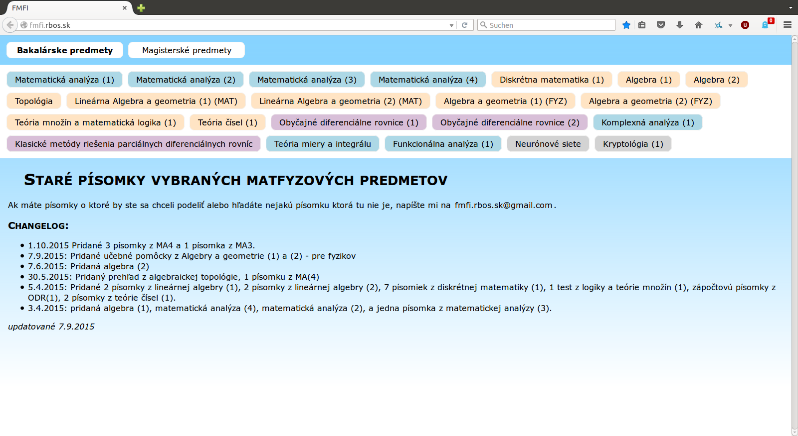

FMFI tests
==========

This is a static webpage written in python. It provides old tests/exams (písomky) for students of matfyz in Bratislava.

It uses the [Bottle](http://bottlepy.org/docs/dev/index.html) framework. It creates a local webserver on localhost.

A running instance of this can be found on [fmfi.rbos.sk](http://fmfi.rbos.sk).

Usage
-----
	python3 fmfimain.py

Dependencies
------------
	python3-bottle